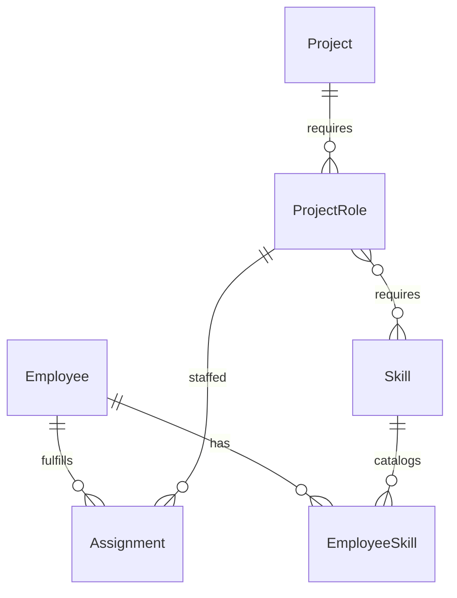
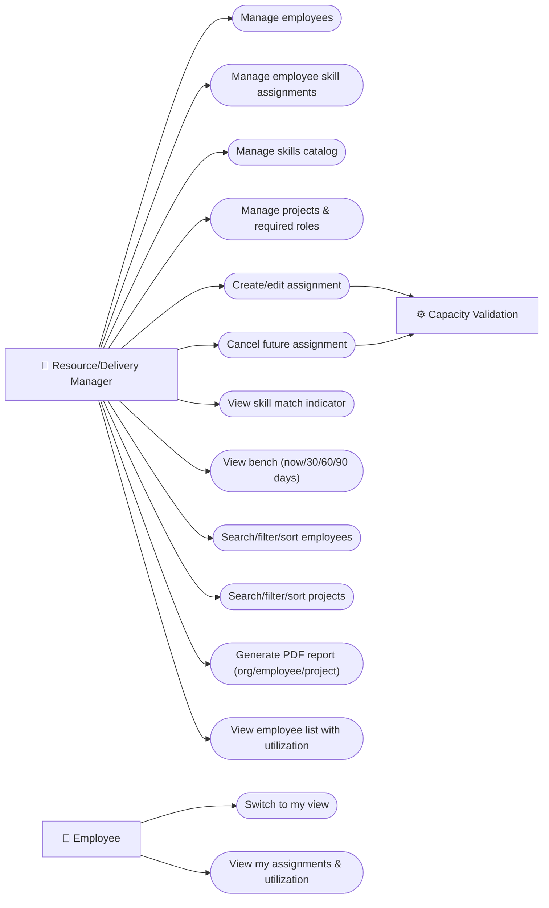

# Product Requirements Document: Team Allocation Platform

**Document Version:** 1.0
**Created:** 2026-09-18
**Project Name:** Team Allocation Platform
**Source Document:** specs/Product-Brief-Team-Allocation-Platform.md

---

## 1. Product Overview

The Team Allocation Platform is an internal resource-planning tool built for a single organization's Resource/Delivery Management function to track how employees are assigned to projects over time — who is working on what, in which role, for how long, and at what capacity. It replaces the failure modes of ad-hoc spreadsheet tracking (double-booking, invisible bench time, slow staffing decisions) with a structured data model where employees, skills, projects, and assignments are explicitly linked and capacity is enforced as a hard constraint: no employee can ever be assigned more than 100% of their capacity across overlapping date ranges. Managers get full CRUD over employees, a dedicated skills catalog, and projects, plus a real-time and forward-looking bench view of unassigned/underutilized staff, org-wide search/filter/sort, and downloadable PDF reports scoped to the whole org, a single employee, or a single project. Employees get a simple, read-only self-service view of their own current, future, and past assignments and utilization. The system uses two distinct UI experiences (manager and employee) selected via a role-switcher rather than credentialed accounts, since this is a demo/practice build using synthetic data rather than a production system. No regulatory compliance requirements apply — this build uses synthetic data only and is not intended for production use with real employee/HR data.

### Scope Exclusions
- Payroll and compensation management
- Time tracking / timesheet capture
- Performance reviews and performance management
- Hiring / recruiting workflows
- Real authentication, login, and permissions enforcement
- Multi-tenant / multi-organization support
- Approval workflows for assignments (a single manager role has full authority)
- Billing rates, cost/margin, or any financial data
- Certifications or complex skill taxonomies/categories beyond a simple catalog with proficiency levels
- Integrations with external HR/PM tools
- Arbitrary date-range picking for the bench view (fixed preset windows only)
- Assignment approval overrides for over-capacity requests (hard block only, no override path)

---

## 2. User Personas

| Role Name | Definition | Expectations |
|-----------|------------|---------------|
| Resource/Delivery Manager | The operator responsible for org-wide staffing decisions; manages the full data set (employees, skills catalog, projects, assignments) and consumes reporting/bench views to plan resourcing. | Expects to create/edit/delete employees, skills, and projects; create and edit assignments with capacity validation enforced automatically; see an org-wide, real-time and forward-looking bench view; search/filter/sort across all entities; generate PDF reports at org, employee, or project scope; and see an advisory skill-match signal when choosing who to assign — without the system silently allowing over-capacity assignments. |
| Employee | An individual staff member represented in the system whose assignment history and current utilization are tracked; interacts with the system in a strictly read-only capacity. | Expects to switch into their own view (via role-switcher, no login) and see their current, future, and past assignments along with their utilization percentage — with no visibility into other employees' data, org-wide bench information, or any edit capability. |

---

## 3. Functional Requirements

| Requirement ID | Requirement | Description |
|---|---|---|
| FR-0001 | Create employee | Manager can create an employee with name, employment start date, employment end date (optional/open-ended), and seniority level (Junior/Mid/Senior). |
| FR-0002 | Edit employee | Manager can edit any employee field defined in FR-0001. |
| FR-0003 | Delete employee | Manager can delete an employee record, provided the employee has no assignments (past, current, or future). If any assignments exist, deletion is blocked with a message explaining why, preserving assignment history relied upon by FR-0022/FR-0024. |
| FR-0004 | Assign skill to employee | Manager can associate an employee with a skill selected from the skills catalog and set a proficiency level (Beginner/Intermediate/Expert) for that employee-skill pairing. An employee may have multiple skills. |
| FR-0005 | Remove/edit employee skill | Manager can remove a skill association from an employee or change its proficiency level. |
| FR-0006 | Create skill (catalog) | Manager can create a new skill in the shared skills catalog (name only; the catalog is the single source of truth for skill selection elsewhere in the system). |
| FR-0007 | Edit skill (catalog) | Manager can edit a skill's name in the catalog. |
| FR-0008 | Delete skill (catalog) | Manager can delete a skill from the catalog. Before deletion proceeds, the system shows an explicit confirmation warning naming the affected records (e.g., "This skill is used by N employees and M project roles — deleting it will remove those associations"). On confirmation, deleting the skill removes its associations from any employees and project roles that reference it. |
| FR-0009 | Create project | Manager can create a project with a start date, end date, and status (Draft/Active/Completed/Cancelled, default Draft). |
| FR-0010 | Define project required roles | Manager can add one or more required roles to a project, each with: a role name (functional, e.g. "Backend Developer"), a target capacity % (0–100), and zero or more required skills selected from the skills catalog (used only as advisory match input per FR-0018 — not enforced). |
| FR-0011 | Edit project | Manager can edit a project's dates, status, and required roles (adding/editing/removing individual roles). Removing a required role is blocked if any assignment currently references that role — the manager must delete/cancel those assignments first (see FR-0017), preventing orphaned assignments. |
| FR-0012 | Delete project | Manager can delete a project, provided the project has no assignments (past, current, or future). If any assignments exist, deletion is blocked with a message explaining why, preserving assignment history relied upon by FR-0022/FR-0024. This keeps project deletion consistent with the employee-deletion policy in FR-0003. |
| FR-0013 | Create assignment | Manager can assign an employee to a specific required role on a project, specifying a capacity % (must be greater than 0 and up to 100; a 0% assignment is not permitted) and a date range (defaulting to the project's dates, adjustable within them). |
| FR-0014 | Enforce capacity limit (hard block) | The system computes, for the assigned employee, the sum of capacity % across all of that employee's assignments whose date ranges overlap the new/edited assignment's date range (inclusive overlap on any shared day). If this sum would exceed 100%, the system rejects the create/edit outright with no override path. This is the single, complete scheduling-conflict rule for MVP — there is no separate rule prohibiting date-range overlap independent of the capacity math. |
| FR-0015 | Restrict assignments to active projects | An assignment can only be created against a project whose status is Active. Attempting to assign against a Draft, Completed, or Cancelled project is rejected. |
| FR-0016 | Edit assignment | Manager can edit an existing assignment's role, capacity %, or date range, but only if the assignment's start date is in the future (today's date or earlier does not qualify) — matching the restriction in FR-0017, so editing cannot be used to rewrite the history that deletion is blocked from touching. Every permitted edit re-runs the same capacity validation defined in FR-0014 (including the >0% bound from FR-0013), evaluated against the employee's other assignments (excluding the assignment being edited). |
| FR-0017 | Delete/cancel assignment | Manager can cancel an assignment whose start date is in the future (today's date or earlier does not qualify) — this is a free deletion since no capacity has actually been consumed yet, and it frees the associated capacity immediately. Deleting an assignment whose start date is today or in the past (i.e., a current or completed assignment) is blocked — historical assignment records cannot be removed, since FR-0022/FR-0024 (reporting and self-service history) and the blocking policies in FR-0003/FR-0011/FR-0012 all depend on that history remaining intact. |
| FR-0018 | Skill match indicator (advisory) | When creating or editing an assignment, the system displays a match tier for each candidate employee against the target role's required skills (FR-0010), computed as: **Strong match** — employee has every required skill at Intermediate or Expert proficiency; **Partial match** — employee has at least one but not all required skills, or has all required skills but at least one only at Beginner proficiency; **No match** — employee has none of the role's required skills. If the role has zero required skills defined, the indicator shows "No requirement" instead of a tier. This indicator is informational only; it never filters or blocks employee selection. |
| FR-0019 | Bench view — current | Manager can view all employees whose total assigned capacity as of today is below 100%, showing each employee's current utilization %. |
| FR-0020 | Bench view — forward-looking windows | Manager can view the same underutilization view projected against fixed preset windows: Next 30 days, Next 60 days, Next 90 days, in addition to Now (FR-0019). No arbitrary custom date range is supported. |
| FR-0021 | PDF report — org-wide | Manager can generate a downloadable PDF summarizing allocations and utilization % for all employees across all projects. |
| FR-0022 | PDF report — per-employee | Manager can generate a downloadable PDF summarizing one employee's assignment history (past, current, future) and utilization %. |
| FR-0023 | PDF report — per-project | Manager can generate a downloadable PDF summarizing one project's staffing: assigned employees, their roles, and capacity %. |
| FR-0024 | Employee self-service view | Employee (via role-switcher) can view their own current, future, and past assignments (project, role, capacity %, dates) and their current utilization %. No other employees' data or org-wide data is visible in this view. |
| FR-0025 | Employee search/filter/sort | Manager can search, filter (by skill, proficiency level, seniority level, current utilization %/availability), and sort (by name, utilization %, employment dates) the employee list. |
| FR-0026 | Project search/filter/sort | Manager can search, filter (by date range, required role, status), and sort (by name, dates) the project list. |
| FR-0027 | Employee list UI with utilization | Manager-facing page listing all employees with their current utilization % and current project assignments shown at a glance, without needing to open each employee's detail record. |

---

## 4. Logical Entity Relations

- **Employee ↔ EmployeeSkill:** one-to-many (an employee has many skill pairings)
- **Skill ↔ EmployeeSkill:** one-to-many (a catalog skill can be held by many employees)
- **Employee ↔ Assignment:** one-to-many (an employee can have many assignments)
- **Project ↔ ProjectRole:** one-to-many (a project defines many required roles)
- **ProjectRole ↔ Assignment:** one-to-many (a role can be staffed by many assignments, e.g. multiple employees splitting one role's capacity)
- **ProjectRole ↔ Skill:** many-to-many (a role can require multiple skills; a skill can be required by multiple roles)

---

## 5. Use Case Diagrams

---

## 6. Epic Breakdown

| EPIC ID | Description |
|---|---|
| EPIC-0001 | **Employee Management** — Create, edit, and delete employees (FR-0001–FR-0003); manage the skills catalog (FR-0006–FR-0008); assign/edit/remove employee-skill-proficiency associations (FR-0004–FR-0005). |
| EPIC-0002 | **Project Management** — Create, edit, and delete projects, including status lifecycle (Draft/Active/Completed/Cancelled) and defining required roles with target capacity % and required skills (FR-0009–FR-0012). |
| EPIC-0003 | **Assignment Engine** — Create and edit assignments with hard-blocked capacity validation (sum ≤100% across overlapping dates), active-project restriction, the future/past edit and delete restrictions, and the advisory skill match indicator (FR-0013–FR-0018). |
| EPIC-0004 | **Bench & Reporting** — Real-time and forward-looking (30/60/90-day) bench views, plus downloadable PDF reports at org-wide, per-employee, and per-project scope (FR-0019–FR-0023). |
| EPIC-0005 | **Employee Self-Service** — Read-only role-switcher view for an employee's own current, future, and past assignments and utilization (FR-0024). |
| EPIC-0006 | **Search, Filter & Employee Overview UI** — Search/filter/sort for employees and projects, and the manager-facing employee list UI showing current utilization at a glance (FR-0025–FR-0027). |

---

**End of Document**
