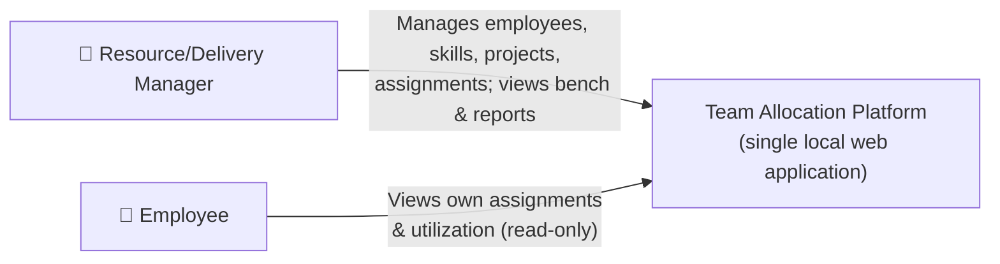
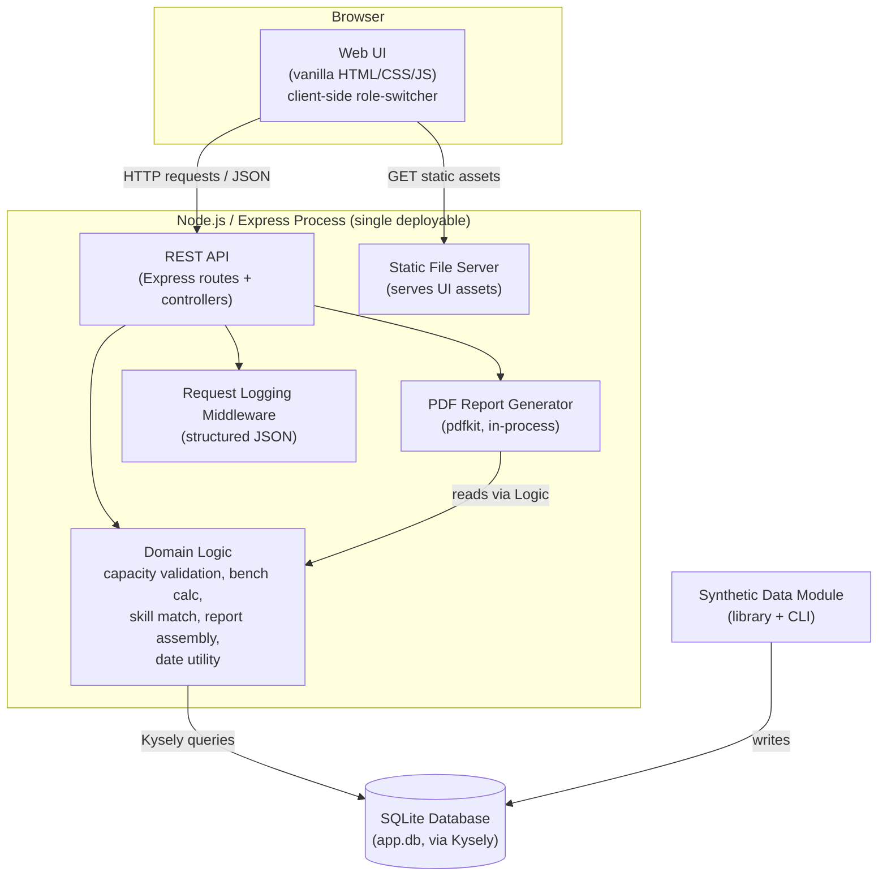
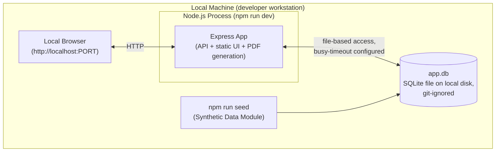

# Solution Design Plan: Team Allocation Platform

**Document Version:** 1.0
**Created:** 2026-09-20
**Project Name:** Team Allocation Platform
**Source Documents:**
- PRD: specs/PRD-Team-Allocation-Platform.md
- Technical Constraints: specs/TECH-CONSTRAINTS-Team-Allocation-Platform.md

---

## 1. Overview

The Team Allocation Platform is designed as a single-process, locally-deployable web application: one Node.js/Express server exposes a REST API and serves a dependency-free vanilla HTML/CSS/JS frontend, with client-side role-switching between the Manager and Employee experiences (no server-side routing based on role, no real authentication). Data is persisted in a local SQLite file, accessed through Kysely for type-safe SQL rather than a full ORM, reflecting the fixed database choice and the absence of a team to onboard. The core of the system — capacity-safe assignment validation, bench calculation, skill-match scoring, and date/overlap computation — lives in the API layer as plain application logic operating on the relational model defined in the PRD. A standalone synthetic-data module (importable library plus CLI) seeds the SQLite file for development, testing, and demo purposes, since no production data source exists. PDF reporting is generated in-process with a lightweight pure-JavaScript library and streamed directly to the browser. The design deliberately avoids cloud services, containerization, CI/CD, and authentication infrastructure — all explicitly out of scope per the Technical Constraints — in favor of the simplest architecture that satisfies the PRD's functional requirements and the project's non-functional goals (test coverage, structured logging, and realistic synthetic data).

---

## 2. Requirements

### 2.1 Non-Functional Requirements

| Requirement ID | Requirement | Description |
|---|---|---|
| NFR-0001 | Unit test coverage | Unit test suite must achieve greater than 70% code coverage, explicitly including edge cases such as over-assignment/over-capacity attempts, boundary values (0% and 100% capacity), and past/future date-boundary conditions on assignment edit/delete rules. |
| NFR-0002 | Integration testing against a real database | Integration tests must run against a real SQLite database instance (not mocked), with the database reset/cleaned up after each test run to keep tests isolated and repeatable. |
| NFR-0003 | Per-request execution-time logging | Every API request must be logged with a structured JSON log line capturing at minimum: timestamp, HTTP method, endpoint/route, duration (ms), and response status code. Logging is scoped to HTTP request/response boundaries only — internal operations (e.g., PDF generation, capacity validation) are not separately instrumented for MVP. |
| NFR-0004 | Standalone synthetic data generation | A synthetic data generation capability must exist as an importable library module (usable from tests and other code) plus a thin CLI wrapper, capable of producing realistic, varied employee/project/assignment data — including edge-case scenarios (e.g., near-100% capacity employees, fully-benched employees, overlapping-but-valid assignments) — for development, testing, and demo purposes. |
| NFR-0005 | Consistent API error responses | All API error responses must follow a single JSON error envelope shape: `{ "error_code": "SCREAMING_SNAKE_CASE", "message": "human-readable description" }`, paired with an appropriate HTTP status code, across every endpoint. |
| NFR-0006 | Graceful handling of near-simultaneous local requests | The SQLite connection must be configured with a busy-timeout so that rare near-simultaneous requests (e.g., two browser tabs open against the same local instance) wait briefly and succeed rather than immediately failing with a database-locked error. This is a resilience safeguard, not a concurrent-multi-user architecture — the system is designed for single-user local usage. |
| NFR-0007 | Local-only deployability | The entire system must run on a single local machine with no cloud provider, external network dependency, or paid service — installable and runnable via standard npm scripts alone (`npm run dev`, `npm test`, `npm run seed`). |
| NFR-0008 | Dependency licensing | All third-party dependencies must use permissive open-source licenses (e.g., MIT, Apache 2.0); dependencies with copyleft obligations (e.g., GPL) must be avoided. |
| NFR-0009 | Consistent date/time comparison | All date/time logic — computing "today," and evaluating date-range overlap for capacity summation (FR-0014), the future/past restriction on assignment edit/delete (FR-0016/FR-0017), and the bench view's preset windows (FR-0019/FR-0020) — must go through a single shared date-comparison utility rather than ad hoc comparisons scattered across the codebase. Given the system is single-timezone/local-only, all comparisons use the local system clock at calendar-day granularity (sub-day time-of-day is not considered), so "today" and "overlap" are defined identically everywhere they are evaluated. |

---

## 3. Architectural Design

### 3.1 C4 Context Diagram (Level 1)

#### Context Diagram Component Catalog

| Element Name | Description |
|---|---|
| Resource/Delivery Manager | Primary user persona with full CRUD access to employees, the skills catalog, projects, and assignments; consumes bench views and PDF reports. |
| Employee | Secondary user persona with strictly read-only access to their own assignment and utilization data via a client-side role-switcher. |
| Team Allocation Platform | The single local web application (frontend + API + database) that both personas interact with directly — there are no external systems in this design. |

### 3.2 C4 Container Diagram (Level 2)

#### Container Diagram Component Catalog

| Element Name | Description |
|---|---|
| Web UI | Vanilla HTML/CSS/JS frontend; renders both Manager and Employee experiences based on a client-side role-switcher, communicating with the API via JSON over HTTP. |
| REST API | Express route/controller layer exposing endpoints for employees, skills, projects, assignments, bench views, and PDF reports; enforces the JSON error envelope (NFR-0005). |
| Domain Logic | Plain TypeScript modules implementing capacity-sum validation (FR-0014), the active-project restriction (FR-0015), the future/past edit/delete rules (FR-0016/FR-0017), skill match tiering (FR-0018), bench computation (FR-0019/FR-0020), report-data assembly/aggregation for org-wide, per-employee, and per-project scopes (FR-0021–FR-0023), and the shared date-comparison utility (NFR-0009). |
| PDF Report Generator | In-process module using a lightweight pure-JS PDF library (pdfkit) to render org-wide, per-employee, and per-project reports (FR-0021–FR-0023) from data assembled by Domain Logic, streaming the result back through the API. |
| Request Logging Middleware | Express middleware that logs structured JSON entries (timestamp, method, route, duration, status) per NFR-0003. |
| Static File Server | Serves the built/plain UI assets from the same Express process (no separate frontend deployment). |
| Synthetic Data Module | Standalone library + CLI (`npm run seed`) that generates and writes realistic demo/test data directly into the SQLite database via the same data-access layer. |
| SQLite Database | Local, file-based relational store (`app.db`, git-ignored) accessed exclusively through Kysely for type-safe SQL; configured with a busy-timeout (NFR-0006). |

### 3.3 Architectural Design Rationale

The design collapses what could be multiple services (frontend, API, worker, report generator) into a single Express process, because the Technical Constraints explicitly rule out cloud infrastructure, containerization, and CI/CD, and the system is built and run by one person on one machine — splitting processes would add operational surface area with no corresponding benefit. Choosing a vanilla JS frontend over a SPA framework follows the same "boring technology" principle: there's no team to onboard, no long-term maintenance handoff, and the UI's actual complexity (a handful of list/detail/form screens plus a role-switcher) doesn't justify a build pipeline or framework runtime. Kysely was chosen over a full ORM (e.g., Prisma/TypeORM) because SQLite is fixed and non-negotiable, the query patterns needed (capacity sums across overlapping date ranges, skill-match joins, bench aggregation) benefit from direct, type-checked SQL rather than an abstraction layer that would need to be worked around for exactly these cases, and there's no team-onboarding cost to offset with an ORM's higher-level ergonomics. Centralizing capacity validation, bench computation, skill matching, report-data assembly, and date/overlap logic into one Domain Logic layer (rather than embedding these rules in route handlers, or letting the PDF generator query the database independently) directly addresses the consistency concern raised during requirements review (NFR-0009) — every consumer of "today," "overlap," or "current utilization," including PDF reports, goes through the same code path, so the capacity rule, the edit/delete restriction, the bench windows, and the report numbers cannot silently drift from one another. PDF generation was placed in-process with a pure-JS library rather than a headless-browser-based tool specifically because the Technical Constraints prohibit anything assuming a production deployment target — a headless browser dependency would be exactly that kind of heavyweight, hard-to-justify addition for a local demo tool. Finally, the synthetic data module is built as a library-first component (with the CLI as a thin wrapper) so the same generation logic can be exercised directly from integration tests (NFR-0002) rather than requiring tests to shell out to a separate script.

---

## 4. Deployments

Given the Technical Constraints rule out cloud infrastructure entirely, there is a single deployment platform: the stakeholder's local machine.

### 4.1 Local Machine Deployment Architecture

#### Local Machine Deployment Component Catalog

| Element Name | Description |
|---|---|
| Node.js Process | The single running instance of the Express application, started via `npm run dev`; hosts the API, static UI files, and PDF generation in one process. |
| app.db (SQLite file) | Local, file-based database on disk; not committed to version control; can be deleted/regenerated at any time via the seed script. |
| npm run seed | CLI entry point to the Synthetic Data Module; populates or resets `app.db` with realistic demo/test data on demand. |
| Local Browser | The stakeholder's web browser, pointed at `localhost`, running the vanilla JS UI and switching between Manager/Employee views client-side. |

### 4.2 Deployment Architecture Rationale

A single local-machine deployment is the only platform this project needs: there is no multi-environment promotion path (dev/staging/prod), no CI/CD pipeline, and no remote hosting per the Technical Constraints — introducing any of that would be pure overhead for a solo practice build with no external users. Keeping the SQLite file on local disk, outside version control, and fully regenerable via `npm run seed` means the "environment" is always reproducible from a clean checkout with one command, which matters more here than deployment sophistication would. The busy-timeout on the database connection (NFR-0006) is the one piece of "production-grade" defensiveness retained in this otherwise minimal deployment, because it's essentially free insurance against a real (if minor) local failure mode — two browser tabs hitting the API at once — without requiring any additional infrastructure.

---

## 5. Architectural Decision Records (ADRs)

| ADR ID | ADR | Comment |
|---|---|---|
| ADR-0001 | Single Express process serves both REST API and static UI assets (no separate frontend build/deploy). | Driven by Technical Constraints ruling out cloud/CI-CD/containerization; avoids unnecessary operational surface area for a solo local build. |
| ADR-0002 | Frontend built as vanilla HTML/CSS/JS with a client-side role-switcher; no SPA framework. | Follows the "boring technology" principle — no team to onboard, UI complexity doesn't justify a framework or build pipeline. |
| ADR-0003 | Data access via Kysely (type-safe query builder) over `better-sqlite3`, rather than a full ORM. | SQLite is fixed and non-negotiable; direct, type-checked SQL suits the capacity/bench/skill-match query patterns better than ORM abstraction, with no team-onboarding cost to offset. |
| ADR-0004 | SQLite database configured with a busy-timeout. | Guards against rare near-simultaneous local requests (e.g., two browser tabs) without treating this as a real concurrency architecture (NFR-0006). |
| ADR-0005 | Capacity validation, active-project restriction, edit/delete date restrictions, skill-match tiering, bench computation, and report-data assembly are centralized in one Domain Logic layer, including a single shared date-comparison utility. | Prevents "today"/"overlap" logic from being implemented inconsistently across features (NFR-0009); PDF reports go through this layer rather than querying the database independently. |
| ADR-0006 | PDF reports generated in-process using a lightweight pure-JS library (pdfkit), not a headless-browser-based tool. | Avoids a heavyweight dependency that would assume a production deployment target, per Technical Constraints. |
| ADR-0007 | Synthetic data generation built as an importable library module with a thin CLI wrapper (`npm run seed`), writing through the same data-access layer as the app. | Enables reuse directly from integration tests (NFR-0002, NFR-0004) rather than requiring tests to shell out to a script. |
| ADR-0008 | SQLite database file (`app.db`) is git-ignored and always regenerated via the seed script rather than committed. | Keeps the repository clean and the seed script as the single source of truth for demo/test data, avoiding stale committed state. |
| ADR-0009 | All API error responses use a single JSON error envelope: `{ "error_code", "message" }` plus an HTTP status code. | Consistency requirement (NFR-0005) — a single envelope shape lets any API consumer (the UI, or a future client) handle errors uniformly without per-endpoint special casing. |
| ADR-0010 | Request logging implemented as Express middleware emitting structured JSON log lines, scoped to HTTP request/response boundaries only. | Satisfies NFR-0003 without extending instrumentation to internal operations (e.g., PDF generation, capacity validation), which is out of scope for MVP. |
| ADR-0011 | No authentication/authorization infrastructure; Manager vs. Employee is a purely client-side UI concept. | Directly mirrors the PRD's explicit exclusion of real auth and the Technical Constraints confirming no auth system exists or is needed. |
| ADR-0012 | Single local-machine deployment target; no cloud, CI/CD, or containerization. | Directly imposed by the Technical Constraints; no multi-environment promotion path exists or is needed. |
| ADR-0013 | Skill deletion's confirmation warning (FR-0008) is implemented as a two-step API interaction: a preview call returns the affected employee/role counts computed server-side, followed by a separate confirmed-delete call. | Keeps the affected-record count authoritative and consistent with the database at the moment of deletion, rather than having the UI estimate it from potentially stale client-side data; avoids duplicating counting logic in the frontend. |

---

## 6. Requirement Mapping

### 6.1 Functional Requirements Mapping

| Requirement ID | How the Design Addresses the Requirement |
|---|---|
| FR-0001 | REST API + Domain Logic + Kysely CRUD against the `Employee` table. |
| FR-0002 | Same as FR-0001 — update path through REST API/Domain Logic. |
| FR-0003 | Domain Logic checks for existing assignments referencing the employee before allowing deletion via the API. |
| FR-0004 | REST API endpoint managing `EmployeeSkill` records, validated against the Skills Catalog. |
| FR-0005 | Same `EmployeeSkill` management endpoint supports update/removal. |
| FR-0006 | REST API + Kysely CRUD against the `Skill` catalog table. |
| FR-0007 | Same as FR-0006 — update path. |
| FR-0008 | API returns affected-record counts (employees/roles) for the confirmation warning; Domain Logic performs the cascading removal on confirmed delete. |
| FR-0009 | REST API + Kysely CRUD against the `Project` table, including status field. |
| FR-0010 | REST API manages `ProjectRole` records (capacity % and required skills), linked to `Project` and `Skill`. |
| FR-0011 | Domain Logic blocks role removal when an `Assignment` references that `ProjectRole`. |
| FR-0012 | Domain Logic blocks project deletion when any `Assignment` exists for that project, mirroring FR-0003. |
| FR-0013 | REST API assignment-creation endpoint; Domain Logic enforces the >0%–100% capacity bound. |
| FR-0014 | Domain Logic's capacity-sum validation, using the shared date-comparison utility (NFR-0009) to determine overlap. |
| FR-0015 | Domain Logic checks the target project's status is Active before allowing assignment creation. |
| FR-0016 | Domain Logic checks the assignment's start date against "today" (via the shared date utility) before permitting an edit, then re-runs FR-0014's validation. |
| FR-0017 | Domain Logic applies the same future/past check as FR-0016 to gate cancel vs. block on delete. |
| FR-0018 | Domain Logic computes the Strong/Partial/No-match/No-requirement tier by comparing an employee's `EmployeeSkill` proficiencies against a `ProjectRole`'s required skills; surfaced by the API to the assignment-creation UI. |
| FR-0019 | Domain Logic's bench computation, using the shared date utility to evaluate capacity as of "today." |
| FR-0020 | Same bench computation, parameterized over the three fixed windows (30/60/90 days), all using the same date utility. |
| FR-0021 | PDF Report Generator renders org-wide data assembled by Domain Logic. |
| FR-0022 | PDF Report Generator renders per-employee data (including full assignment history) assembled by Domain Logic. |
| FR-0023 | PDF Report Generator renders per-project data assembled by Domain Logic. |
| FR-0024 | Web UI's Employee view calls a scoped API endpoint returning only the requesting employee's own assignments/utilization. |
| FR-0025 | REST API exposes filter/sort query parameters over the `Employee` list, backed by Kysely queries. |
| FR-0026 | REST API exposes filter/sort query parameters over the `Project` list, backed by Kysely queries. |
| FR-0027 | Web UI's Manager landing page consumes the employee list endpoint (with current utilization included) to render the at-a-glance view. |

### 6.2 Non-Functional Requirements Mapping

| Requirement ID | How the Design Addresses the Requirement |
|---|---|
| NFR-0001 | Vitest unit test suite covering Domain Logic modules (capacity, bench, skill match, date utility) with edge cases; coverage measured via Vitest's coverage tooling. |
| NFR-0002 | Vitest integration tests run against a real SQLite instance (e.g., temp file or in-memory), with setup/teardown resetting the database each run. |
| NFR-0003 | Express Request Logging Middleware emits structured JSON per request. |
| NFR-0004 | Synthetic Data Module (library + CLI) as its own container component, reusable from tests and `npm run seed`. |
| NFR-0005 | REST API layer enforces the `{ error_code, message }` envelope on every error response. |
| NFR-0006 | SQLite connection configured with a busy-timeout at the data-access layer. |
| NFR-0007 | Single Express process + npm scripts; no external services in the entire architecture. |
| NFR-0008 | Dependency choices (Express, Kysely, better-sqlite3, pdfkit, Vitest) are all permissively licensed (MIT/Apache 2.0/ISC), verified at dependency-selection time. |
| NFR-0009 | Single shared date-comparison utility in Domain Logic, used by every FR that computes "today" or "overlap," including report-data assembly. |

---

**End of Document**
