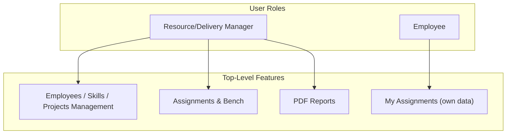
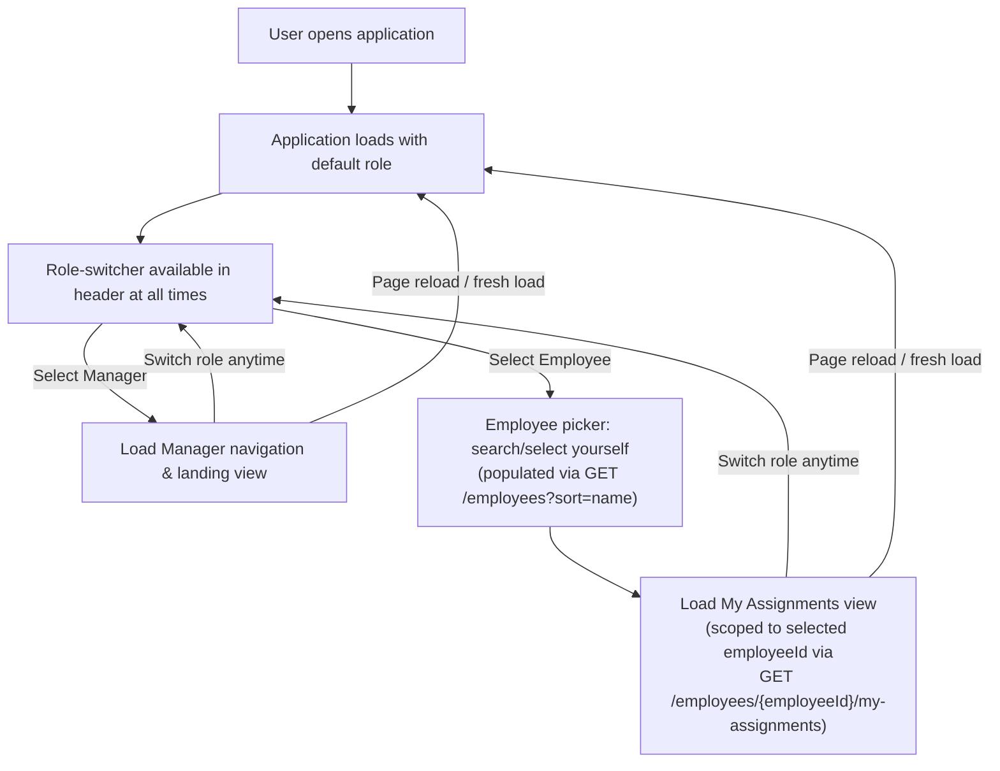
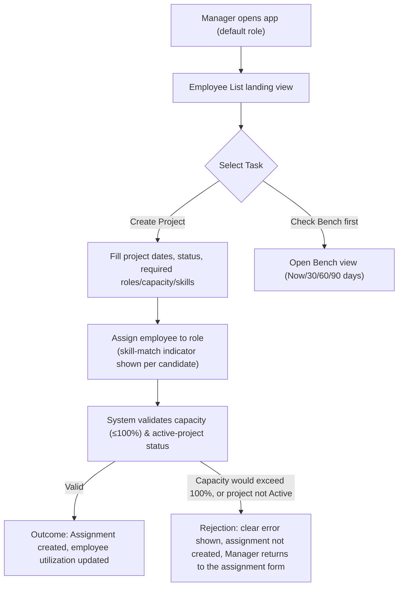
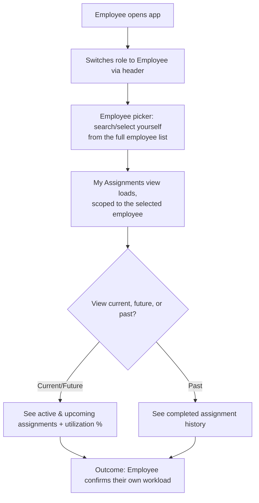
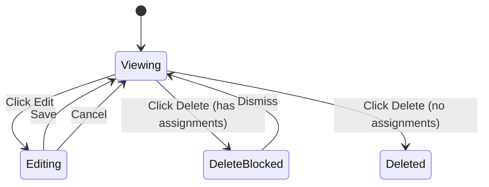
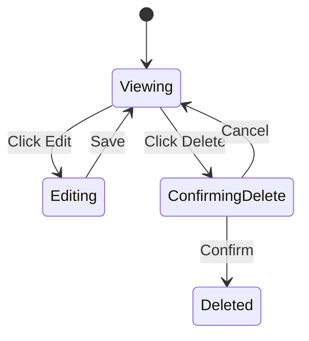
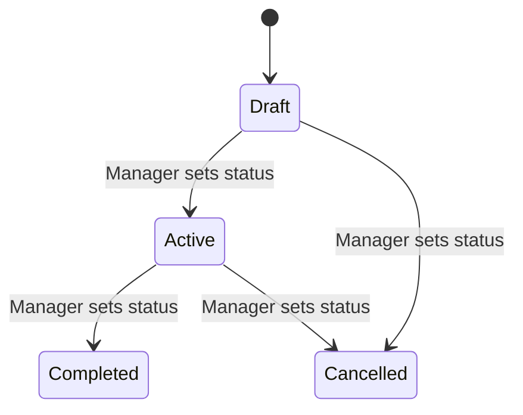
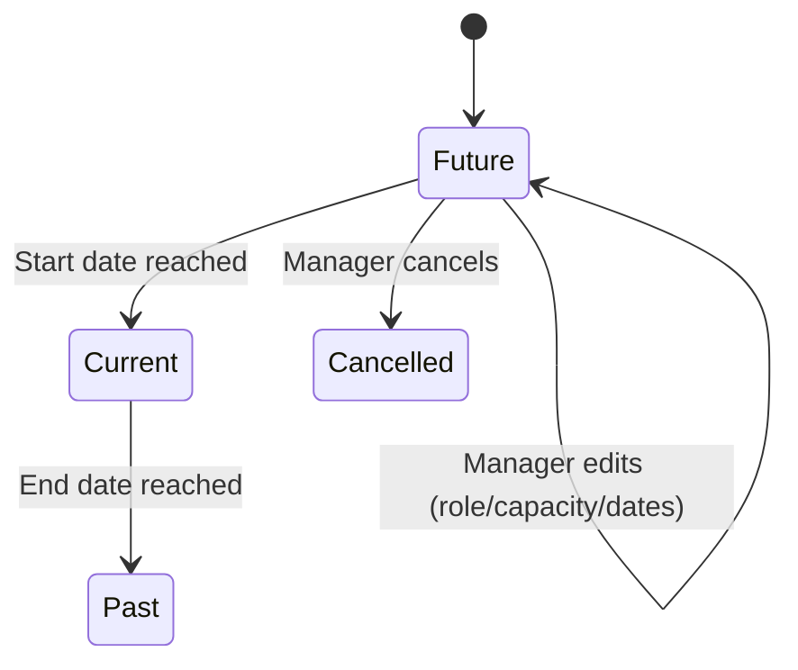
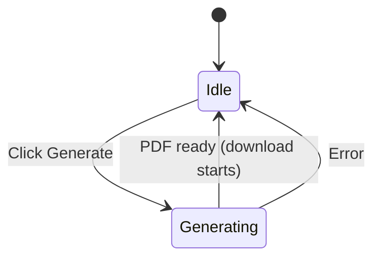

# UX Specification: Team Allocation Platform

## Document Information
- **Project**: Team Allocation Platform
- **Version**: 1.1
- **Last Updated**: 2026-09-22
- **Owner(s)**: Cesar (solo practice build)

---

## Table of Contents
1. [Overview](#overview)
2. [User Roles & Permissions](#user-roles--permissions)
3. [Access & Session Management](#access--session-management)
4. [User Journeys](#user-journeys)
5. [Feature Specifications](#feature-specifications)
6. [Visual Design Guidelines](#visual-design-guidelines)
7. [Conclusion](#conclusion)

---

## Overview
### Purpose
This specification defines the user experience for the Team Allocation Platform, an internal resource-planning tool that lets a Resource/Delivery Manager track employee-to-project assignments, capacity, and skills, while giving each Employee a read-only view of their own assignments and utilization. The UI is a single, dependency-free web application (vanilla HTML/CSS/JS) with a client-side role-switcher — there is no login, and no separate deployment per role.

### Key Objectives
- Let a Manager see, at a glance, who is working on what, in which role, and at what utilization — without cross-checking a spreadsheet.
- Make capacity limits and scheduling rules visible and self-explanatory in the UI, since the system enforces them as hard constraints (no override).
- Give an Employee a simple, zero-friction way to see their own current, future, and past assignments.

### Core Features (current release scope)
- Employee management (CRUD) with seniority and skill-proficiency assignment
- Skills catalog management (CRUD)
- Project management (CRUD) with status lifecycle and required roles/capacity/required skills
- Assignment creation/edit/cancel with hard-blocked capacity validation and advisory skill-match indicator
- Bench view (Now / 30 / 60 / 90 days)
- PDF report generation (org-wide, per-employee, per-project)
- Employee self-service read-only view
- Search/filter/sort across employees and projects

> **Out of Scope** (per PRD Scope Exclusions): payroll, timesheets, performance reviews, recruiting/hiring, real authentication/authorization, multi-tenant support. None of these have any UI surface in this spec.

---

## User Roles & Permissions

### Role Overview (Mermaid)

> Only two roles exist for this product (Manager, Employee); the template's third role slot has been removed rather than left as an unused placeholder.

---

### Resource/Delivery Manager
**Primary Responsibilities**: Own all org-wide staffing decisions — maintain employee, skill, and project data, create and manage assignments within capacity rules, monitor bench/utilization, and produce reports.

**Access Rights**:
- Full create/read/update/delete on Employees, Skills catalog, and Projects (subject to the dependent-record blocking rules defined in the PRD)
- Full create/read/update on Assignments, with cancel available only for future-dated assignments
- Read access to the org-wide Bench view and all PDF report scopes

**Navigation Access**:
- Employees, Projects, Skills Catalog, Assignments, Bench, Reports (all top-level nav items)

**Key Capabilities**:
- Create/edit/delete employees, skills, and projects
- Create/edit assignments with real-time capacity and skill-match feedback
- View current + forward-looking bench, and generate PDF reports at org/employee/project scope

---

### Employee
**Primary Responsibilities**: View their own assignment history and current utilization; no editing capability of any kind.

**Access Rights**:
- Read-only access to their own current, future, and past assignments and utilization percentage
- No access to other employees' data, org-wide bench, project management, or reports

**Navigation Access**:
- Single "My Assignments" view; no navigation menu (nothing else to navigate to)

**Key Capabilities**:
- View own assignment list (project, role, capacity %, dates) and current utilization %

---

## Access & Session Management
> This system has no authentication or session infrastructure of any kind — the role-switcher is a purely client-side UI concept, not a security boundary. The flow below reflects that: there is no credential step, no failure state, and no session expiry.

### Access Flow (Mermaid)

**Post-Access Behavior**
- Role resolution: purely client-side UI state, selected via the header role-switcher dropdown — not derived from any credential, token, or server-side session.
- Employee identity resolution: selecting "Employee" does **not** immediately resolve to a specific person's data. Since there is no authentication, the switcher first presents an employee picker (search/select from the full employee list) — the user must identify themselves manually. Only after a selection is made does the app load that employee's own data; the selected employee's ID is then scoped into every subsequent self-service call for that session.
- Navigation shaping: selecting "Manager" surfaces the full top-level nav (Employees, Projects, Skills Catalog, Assignments, Bench, Reports); selecting "Employee" first shows the picker, then replaces the nav with the single "My Assignments" view once an employee has been selected.
- Session behaviors: none apply — there is no login, no session timeout, no "remember me," and no idle lock. The role selection (and, for Employee, the selected employee identity) persists only for the current browser session/tab state and resets to the default role — and clears the selected employee — on a fresh page load.
- Default role on load: Manager (the primary/most-used persona for this internal tool).

---

## User Journeys

### Manager Journey — Staff a New Project

**Narrative**
1. Manager lands on the Employee List view showing current utilization at a glance.
2. To staff a new project, the Manager creates the project (dates, status, required roles with capacity % and optional required skills), then opens the assignment form.
3. The assignment form shows a skill-match indicator (Strong/Partial/No match/No requirement) per candidate employee, computed from the role's required skills and each employee's proficiency — advisory only, it never filters the candidate list.
4. Alternate path: before assigning, the Manager checks the Bench view to find who's free, optionally projecting 30/60/90 days out.
5. On submission, the system validates capacity and active-project status. If valid, the assignment is created and utilization updates immediately. If the assignment would exceed 100% capacity or the target project isn't Active, the system rejects it outright with a clear error message, creates nothing, and returns the Manager to the assignment form to adjust and retry — there is no override path.

### Employee Journey — Check My Assignments

**Narrative**
1. Employee switches the header role-switcher to "Employee."
2. Since there is no login, the app cannot know who this is — the Employee must first search/select themselves from the full employee list in a picker.
3. Once selected, the "My Assignments" view loads, scoped to that employee, showing current, future, and past assignments with role, project, capacity %, and dates.
4. No navigation menu or other screens are available — this is a single, self-contained read-only view.
5. Outcome: the Employee confirms their own workload without needing to ask the Manager.

---

## Feature Specifications

### Employee Management
#### Purpose
Let the Manager maintain the roster of employees and their skill profiles — the foundation for every assignment, capacity, and matching feature.

#### Components
- Employee list table (also the app's landing view — see FR-0027)
- Employee detail/edit form
- Employee-skill assignment sub-form (skill picker from catalog + proficiency selector)

#### Tables (if any)
| Column | Description | Visible To |
|---|---|---|
| Name | Employee full name | Manager |
| Seniority | Junior / Mid / Senior | Manager |
| Current Utilization % | Sum of current active assignment capacity | Manager |
| Current Projects | Names of projects currently assigned to | Manager |
| Skills | Skill tags with proficiency, shown as chips | Manager |

#### Dialogs & Forms (if any)
- Fields: Name, employment start date, employment end date (optional), seniority level
- Defaults: employment end date empty (open-ended)
- Validation: name required; start date required and must precede end date if provided
- Actions: Save (create/update), Delete (blocked with explanation if the employee has any assignments), Add Skill (opens skill picker + proficiency selector), Remove Skill

#### States & Transitions (if applicable)


#### Role-based Actions
- Manager: full create/edit/delete, manage skill associations
- Employee: no access to this feature

#### Filters/Sorting/Pagination (if applicable)
- Filters: skill, proficiency level, seniority level, current utilization %/availability (FR-0025)
- Sorting: name, utilization %, employment dates
- Pagination: simple page-based or "load more" list, given demo-scale data (tens of employees)

#### Edge Cases & Empty States
- No employees yet: show an empty state with a prompt to create the first employee (or run the seed script)
- Deleting an employee with assignments: blocked, with a message identifying that assignments must be removed first (not applicable in practice for past/current per the assignment rules, but future assignments could be cancelled first)

#### Notifications (Toasts/Errors/Confirmations)
- Success: "Employee saved."
- Error: "Can't delete this employee — they have existing assignments."
- Confirmation Dialog: "Delete [Employee Name]? This cannot be undone."

---

### Skills Catalog
#### Purpose
Maintain the single, shared list of skills used everywhere skills are referenced (employee profiles, project role requirements, skill-match scoring).

#### Components
- Skills catalog list
- Skill create/edit form (name only)

#### Tables (if any)
| Column | Description | Visible To |
|---|---|---|
| Skill Name | Name of the skill (e.g., "React") | Manager |
| Used By | Count of employees and project roles referencing this skill | Manager |

#### Dialogs & Forms (if any)
- Fields: Skill name
- Defaults: none
- Validation: name required, must be unique in the catalog
- Actions: Save, Delete (with confirmation warning naming affected record counts per FR-0008)

#### States & Transitions (if applicable)


#### Role-based Actions
- Manager: full create/edit/delete
- Employee: no access to this feature

#### Filters/Sorting/Pagination (if applicable)
- Filters: none needed at this scale
- Sorting: name
- Pagination: none needed at this scale

#### Edge Cases & Empty States
- No skills yet: empty state prompting creation of the first skill
- Deleting a skill in use: confirmation dialog explicitly states "This skill is used by N employees and M project roles — deleting it will remove those associations" before allowing deletion (FR-0008)

#### Notifications (Toasts/Errors/Confirmations)
- Success: "Skill saved."
- Error: "A skill with this name already exists."
- Confirmation Dialog: "This skill is used by {{N}} employees and {{M}} project roles — deleting it will remove those associations. Delete anyway?"

---

### Project Management
#### Purpose
Let the Manager define projects, their timelines, status, and the roles they need staffed — the demand side of the allocation model.

#### Components
- Project list table
- Project detail/edit form
- Required-role sub-form (role name, capacity %, required skills)

#### Tables (if any)
| Column | Description | Visible To |
|---|---|---|
| Project Name | Name of the project | Manager |
| Status | Draft / Active / Completed / Cancelled | Manager |
| Dates | Start – End | Manager |
| Required Roles | Count of roles defined, with staffing progress | Manager |

#### Dialogs & Forms (if any)
- Fields: Project name, start date, end date, status; per-role: role name, capacity %, required skills (zero or more)
- Defaults: status = Draft on creation
- Validation: name and dates required; start precedes end; capacity % must be greater than 0 and up to 100 per role (**UX-layer clarification, not explicitly stated in PRD FR-0010** — see Appendix; excluding 0 mirrors the rationale already applied to assignment capacity in FR-0013, since a 0%-capacity role requirement is equally meaningless)
- Actions: Save, Add/Edit/Remove Role (role removal blocked if an assignment references it — FR-0011), Delete Project (blocked if any assignment exists — FR-0012)

#### States & Transitions (if applicable)
> **UX-layer assumption** (see Appendix): the PRD's FR-0009 defines the four status values but no transition constraints. The diagram below is a deliberate UX-layer decision — not a documented product requirement — proposed because allowing arbitrary transitions (e.g., Completed → Active) would be confusing and likely unintended.


#### Role-based Actions
- Manager: full create/edit/delete, manage required roles
- Employee: no access to this feature

#### Filters/Sorting/Pagination (if applicable)
- Filters: date range, required role, status (FR-0026)
- Sorting: name, dates
- Pagination: simple page-based or "load more" list

#### Edge Cases & Empty States
- No projects yet: empty state prompting creation of the first project
- Deleting a project with assignments: blocked, with explanation (FR-0012)
- Removing a required role that has assignments: blocked, with explanation (FR-0011)
- Assigning against a non-Active project: the assignment form disables/hides non-Active projects as assignment targets (see Assignments feature)

#### Notifications (Toasts/Errors/Confirmations)
- Success: "Project saved."
- Error: "Can't delete this project — it has existing assignments." / "Can't remove this role — it has existing assignments."
- Confirmation Dialog: "Delete [Project Name]? This cannot be undone."

---

### Assignments
#### Purpose
Connect an employee to a project role at a given capacity %, enforcing the hard capacity cap and surfacing an advisory skill-match signal — the core value proposition of the platform.

#### Components
- Assignment creation/edit form (employee picker, project + role picker restricted to Active projects, capacity % input, date range)
- Per-candidate skill-match indicator (Strong / Partial / No match / No requirement)
- Assignment list (embedded in Employee detail and Project detail views)

#### Tables (if any)
| Column | Description | Visible To |
|---|---|---|
| Employee | Assigned employee name | Manager |
| Project / Role | Project name and functional role | Manager |
| Capacity % | Assigned capacity percentage | Manager |
| Dates | Start – End | Manager |
| Skill Match | Strong / Partial / No match / No requirement (advisory, informational only) | Manager |

#### Dialogs & Forms (if any)
- Fields: Employee, Project (Active only), Role, Capacity %, Start date, End date (defaults to project dates)
- Defaults: dates default to the project's dates, adjustable within them
- Validation: capacity % must be greater than 0 and up to 100; sum of overlapping-date capacity for the employee must not exceed 100% (hard block, no override); target project must be Active; edits/cancellations only permitted while the assignment's start date is in the future
- Actions: Save (create/edit, future-dated only), Cancel (future-dated only — past/current assignments cannot be removed)

#### States & Transitions (if applicable)


#### Role-based Actions
- Manager: create, edit (future-dated only), cancel (future-dated only)
- Employee: read-only view of their own assignments only (no create/edit/cancel)

#### Filters/Sorting/Pagination (if applicable)
- Filters: by project, by employee (contextual, within Employee/Project detail views)
- Sorting: by date
- Pagination: not typically needed at this scale, within a single employee's or project's assignment list

#### Edge Cases & Empty States
- No candidates match the role's required skills: all employees still shown, marked "No match" — selection is never blocked
- Attempting to assign against a Draft/Completed/Cancelled project: those projects are excluded from the project picker in the assignment form
- Attempting to exceed 100% capacity: form submission is rejected with a clear message showing the employee's existing overlapping commitments
- Attempting to edit/cancel a current or past assignment: the Edit/Cancel actions are disabled (not merely rejected on submit) for assignments whose start date is today or earlier, with an inline explanation

#### Notifications (Toasts/Errors/Confirmations)
- Success: "Assignment saved."
- Error: "This assignment would put [Employee] at {{X}}% capacity — the maximum is 100%." / "This project isn't Active — assignments can only be made against Active projects."
- Confirmation Dialog: "Cancel this assignment for [Employee] on [Project]?"

---

### Bench View
#### Purpose
Give the Manager a real-time and forward-looking view of unassigned/underutilized employees, to support fast staffing decisions.

#### Components
- Window selector: Now / Next 30 days / Next 60 days / Next 90 days
- Underutilized employee list with utilization % for the selected window

#### Tables (if any)
| Column | Description | Visible To |
|---|---|---|
| Employee | Employee name | Manager |
| Utilization % (selected window) | Total assigned capacity as of the selected window | Manager |
| Available Capacity % | 100% minus utilization | Manager |
| Skills | Skill tags with proficiency, for quick scanning | Manager |

#### Dialogs & Forms (if any)
- N/A — this is a read-only view with a window selector, no forms

#### States & Transitions (if applicable)
- N/A — no multi-step state machine; switching the window selector simply re-queries the same view

#### Role-based Actions
- Manager: view only, all four windows
- Employee: no access to this feature

#### Filters/Sorting/Pagination (if applicable)
- Filters: window selector (Now/30/60/90 — fixed presets only, no custom date range)
- Sorting: utilization % (ascending, most-available first, by default)
- Pagination: not typically needed at demo scale

#### Edge Cases & Empty States
- No underutilized employees in the selected window (fully staffed org): empty state — "No bench capacity in this window — everyone is fully allocated."

#### Notifications (Toasts/Errors/Confirmations)
- N/A — this is a passive, read-only view with no write actions or confirmations

---

### PDF Reports
#### Purpose
Let the Manager generate a downloadable PDF snapshot of allocations and utilization, scoped to the whole org, a single employee, or a single project.

#### Components
- Report scope selector (Org-wide / Per-Employee / Per-Project)
- Entity picker (shown only for Per-Employee/Per-Project scopes)
- Generate button with in-progress indicator

#### Tables (if any)
- N/A in the UI itself — the generated PDF contains allocation/utilization tables per the SDP's Domain Logic report assembly; this UX spec covers only the on-screen trigger, not PDF page layout.

#### Dialogs & Forms (if any)
- Fields: Scope (Org-wide/Per-Employee/Per-Project), Entity (employee or project, if applicable)
- Defaults: Org-wide
- Validation: entity selection required for Per-Employee/Per-Project scopes
- Actions: Generate (streams a downloadable PDF)

#### States & Transitions (if applicable)


#### Role-based Actions
- Manager: generate all three report scopes
- Employee: no access to this feature

#### Filters/Sorting/Pagination (if applicable)
- N/A — scope/entity selection only, no list to filter/sort/paginate

#### Edge Cases & Empty States
- Per-Employee/Per-Project scope with no entity selected: Generate button disabled until a selection is made
- Report generation takes a perceptible moment: show a minimal in-progress indicator (e.g., a spinner on the Generate button) so the click doesn't feel unresponsive — this is the one place in the app where a loading state is expected, since all other operations against the local SQLite database feel effectively instant

#### Notifications (Toasts/Errors/Confirmations)
- Success: PDF download begins automatically; no separate success toast needed
- Error: "Couldn't generate the report. Please try again."
- Confirmation Dialog: N/A — generation is non-destructive, no confirmation needed

---

### Employee Self-Service (My Assignments)
#### Purpose
Give an Employee a simple, read-only view of their own assignment history and current utilization.

#### Components
- Employee picker (search/select yourself from the full employee list) — shown once, immediately after switching to the Employee role, before "My Assignments" loads (added in v1.1; see Appendix)
- Utilization summary (current %)
- Assignment list (current, future, past)

#### Tables (if any)
| Column | Description | Visible To |
|---|---|---|
| Project | Project name | Employee (own data only) |
| Role | Functional role on that project | Employee (own data only) |
| Capacity % | Assigned capacity percentage | Employee (own data only) |
| Dates | Start – End | Employee (own data only) |
| Status | Current / Future / Past | Employee (own data only) |

#### Dialogs & Forms (if any)
- N/A — no editing capability of any kind on this view

#### States & Transitions (if applicable)
- N/A — static read-only view

#### Role-based Actions
- Employee: view only, own data only
- Manager: not applicable — Manager uses the Employee Management feature for this data instead

#### Filters/Sorting/Pagination (if applicable)
- Filters: none required — full history is shown at once given demo-scale data volume
- Sorting: by date (most recent/current first)
- Pagination: none needed at this scale

#### Edge Cases & Empty States
- Employee has no assignments at all: empty state — "You have no assignments yet."

#### Notifications (Toasts/Errors/Confirmations)
- N/A — passive, read-only view with no write actions

---

## Visual Design Guidelines
> **⚠️ Placeholder tokens.** No branding guidelines were provided for this project (per input: none exist). The values below are sensible, reusable defaults proposed for a small internal tool — not a real brand guide. Swap freely if a preference emerges later.

### Branding & Palette
- Primary: `#2563EB` (blue-600) — primary actions, active nav state
- Accent: `#0EA5E9` (sky-500) — secondary highlights, links
- Neutral: `#334155` (slate-700) text / `#F1F5F9` (slate-100) backgrounds / `#E2E8F0` (slate-200) borders

### Status Colors
- Success: `#16A34A` (green-600)
- Warning: `#D97706` (amber-600)
- Danger: `#DC2626` (red-600) — used for hard-block capacity errors and destructive confirmations
- Info: `#0891B2` (cyan-600) — used for advisory signals like the skill-match indicator

### Typography
- Display/Heading: system font stack (`-apple-system, Segoe UI, Roboto, sans-serif`) (weights 600–700)
- Body: same system font stack (sizes 14px body / 16px form inputs / 12px table meta text)

### Spacing & Layout
- Base unit: 8px (multiples: 8/16/24/32)
- Container widths: max 1200px centered layout for list/table views; forms capped at 640px

### Responsive Breakpoints
- Mobile: not supported (desktop-only per scope)
- Tablet: not supported (desktop-only per scope)
- Desktop: 1024px minimum; layout should not actively break down to ~900px, but no dedicated responsive work below that

### Accessibility (WCAG)
- Contrast: aim for readable contrast (~4.5:1 body text) as a good-practice default, not a formal WCAG audit target
- Focus: visible focus outline on all interactive elements (default browser focus ring is acceptable, not suppressed)
- Keyboard: all forms and nav must be operable via Tab/Enter/Escape; no keyboard traps
- Validation semantics: form errors associated with their field via standard HTML (`aria-invalid`, associated `<label>`s) — no custom ARIA framework needed for this simple form set

---

## Appendix

### Key User Flows Summary
```
Resource/Delivery Manager → Employee List (landing) → check Bench → create/staff Project → assign Employee (capacity + skill-match checked) → generate PDF Report
Employee → switch role via header → select yourself from employee picker → My Assignments (current/future/past + utilization %)
```

### Version History
| Version | Date | Author | Description |
|---|---|---|---|
| 1.0 | 2026-09-22 | Cesar (with Jonathan, AI UX facilitation) | Initial version |
| 1.1 | 2026-09-22 | Cesar (with Katarina, during BFF Contract design) | Patched a gap surfaced while designing the BFF Contract: added the missing employee-selection ("select yourself") step to the Access Flow diagram and Employee Journey, since the Employee role has no other way to establish identity without authentication. See updated Access & Session Management and User Journeys sections, and the resolved Assumptions entry below. |

### Assumptions & Open Questions
- **Third role-template slot removed.** The `ux-template.md` base supports up to three roles; only two exist for this product (Manager, Employee), so the third slot was removed rather than left as an unused placeholder.
- **Project status transition rules (UX-layer assumption) — now resolved.** The PRD's FR-0009 defines the four status values (Draft/Active/Completed/Cancelled) but states no transition constraints. This spec proposes a specific transition graph (Draft→Active→{Completed,Cancelled}, Draft→Cancelled; no path back from Completed or Cancelled) as a deliberate UX-layer decision. **Resolution:** confirmed and enforced server-side in `BFF-CONTRACT-Team-Allocation-Platform.md` — `PATCH /projects/{projectId}` validates this exact graph and rejects invalid transitions with `INVALID_STATUS_TRANSITION`.
- **Required-role capacity % excludes 0 (UX-layer clarification) — now resolved.** The PRD's FR-0010 states a target capacity % range of "0–100" without excluding 0 explicitly. This spec applies a stricter ">0 and ≤100" rule, mirroring the rationale already used for assignment capacity in FR-0013. **Resolution:** carried through into the BFF Contract's OpenAPI schema (`ProjectRoleCreateRequest`/`ProjectRoleUpdateRequest.capacityPercent`, minimum 1).
- **Employee self-service identity (UX gap) — now resolved.** Originally, this spec described switching to the Employee role and landing directly on "My Assignments" without explaining how the system determines *which* employee that is, given there is no authentication. **Resolution:** surfaced during BFF Contract design and patched in v1.1 — the Employee role-switcher now requires an explicit "select yourself" step (a picker populated via `GET /employees?sort=name`) before "My Assignments" loads, scoped to the selected `employeeId` via `GET /employees/{employeeId}/my-assignments`. See Access & Session Management and the Employee Journey.
- **No live UI evidence existed for this spec** (net-new build, no code/Figma/wireframes) — all screens, tables, and states were derived from the PRD and SDP rather than reconciled against an existing artifact.
- **Visual design tokens are placeholders**, not a real brand guide — see the callout in Visual Design Guidelines.

---

## Conclusion
This UX Specification translates the Team Allocation Platform's PRD and SDP into a concrete, implementation-ready interface: a single vanilla-JS web app with a client-side Manager/Employee role-switcher, six Manager-facing features (Employee, Skills, Project, Assignment, Bench, Reports management) built around the hard-blocked capacity engine and advisory skill-match signal, and one read-only Employee self-service view. Two gaps not explicitly covered by the PRD — project status transition rules and the required-role capacity floor — were resolved as explicit, flagged UX-layer decisions rather than silent assumptions, ready for confirmation during backend/API design. Visual design uses clearly-marked placeholder tokens suited to a small internal tool, since no brand guide exists. This document is ready for engineering handoff alongside the PRD and SDP.

---
**Document End**
