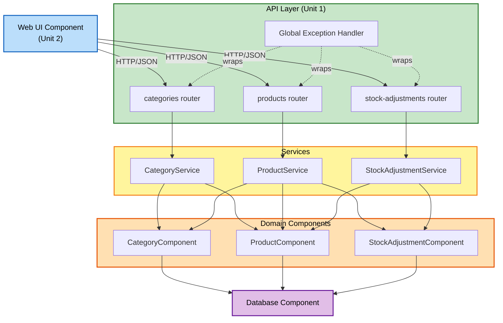

# Component Dependencies — Warehouse Inventory System

## Dependency Matrix

| Component | Depends On | Reason |
|---|---|---|
| CategoryComponent | Database | Persistence access |
| ProductComponent | Database | Persistence access |
| StockAdjustmentComponent | Database | Persistence access |
| CategoryService | CategoryComponent, ProductComponent | Category CRUD + cross-domain delete-eligibility check |
| ProductService | ProductComponent, CategoryComponent, StockAdjustmentComponent | Product CRUD + category validation + cross-domain delete-eligibility check |
| StockAdjustmentService | StockAdjustmentComponent, ProductComponent | Adjustment recording + product-status/stock validation |
| API Layer (routers) | CategoryService, ProductService, StockAdjustmentService | Request handling delegates to exactly one service call |
| API Layer (global exception handler) | (cross-cutting) | Wraps all router calls; catches domain exceptions raised by any service |
| Web UI Component | API Layer (over HTTP, out-of-process) | All UI actions are REST calls; no in-process dependency on backend components |

## Communication Patterns
- **In-process (Unit 1 — Inventory API)**: Direct Python method calls — Service → Component, Service → other Component (read-only cross-domain checks), Router → Service.
- **Out-of-process (Unit 2 → Unit 1)**: HTTP/JSON over `fetch`, matching the REST API contract exposed by the API Layer.
- **No circular dependencies**: `CategoryComponent` and `ProductComponent` never call each other directly — only their respective Services reach across (Service → other domain's Component), and only for read-only eligibility checks (counts), never for writes.

## Data Flow: Illustrative Example (Delete a Category)
1. Web UI sends `DELETE /categories/{id}` after user confirms the destructive action.
2. `categories` router calls `CategoryService.delete_category(id)`.
3. `CategoryService` calls `ProductComponent.count_by_category(id)`.
4. If count is 0 → `CategoryComponent.hard_delete(id)`; else → `CategoryComponent.soft_delete(id)`.
5. Result returned up through the router; on success, Web UI refreshes the category listing. On a raised domain exception (e.g. category not found), the global exception handler formats the error response, which `api-client.js` translates into a user-facing message.

## Dependency Diagram



### Text Alternative
```
Web UI (Unit 2)
  -> HTTP/JSON -> categories router / products router / stock-adjustments router  (Unit 1, API Layer)
       [wrapped by Global Exception Handler]
       categories router    -> CategoryService
       products router      -> ProductService
       stock-adjustments router -> StockAdjustmentService

CategoryService        -> CategoryComponent, ProductComponent (read-only count)
ProductService          -> ProductComponent, CategoryComponent (read-only get), StockAdjustmentComponent (read-only count)
StockAdjustmentService  -> StockAdjustmentComponent, ProductComponent (read-only get + write set_stock)

CategoryComponent, ProductComponent, StockAdjustmentComponent -> Database Component
```
