# Execution Plan — Warehouse Inventory System

## Detailed Analysis Summary

### Change Impact Assessment
- **User-facing changes**: Yes — entirely new system; users interact via REST API and a full-CRUD web UI.
- **Structural changes**: Yes — new application built from scratch (no existing architecture to preserve).
- **Data model changes**: Yes — new schema: `categories`, `products`, `stock_adjustments` (history), with soft-delete (`deleted_at`) on categories and products.
- **API changes**: Yes — new REST API surface: category CRUD, product CRUD, stock-adjustment endpoints, history retrieval, sorting/filtering, category totals.
- **NFR impact**: Yes — ≥70% unit test coverage, global error handling with structured logging, atomic delete-eligibility checks, non-negative-stock invariant enforcement.

### Component Relationships
- **Primary Components**: Domain/persistence layer (categories, products, stock adjustments), REST API layer (FastAPI/Flask routes + error handling), Web UI (static HTML/CSS/vanilla JS).
- **Dependent Components**: Web UI depends on the REST API being available; no other external dependents (single local instance, no auth, no external services).
- **Supporting Components**: SQLite database file (local), logging configuration, test suite.

### Risk Assessment
- **Risk Level**: Low — greenfield build, well-scoped requirements, no external integrations, no concurrency/auth complexity, standard CRUD + business-rule patterns.
- **Rollback Complexity**: Easy — no production deployment in scope; a failed iteration only affects local dev artifacts.
- **Testing Complexity**: Moderate — the conditional hard/soft-delete branching and the non-negative-stock invariant need deliberate edge-case test coverage to hit the 70% target meaningfully (not just line coverage on the happy path).

## Workflow Visualization

```mermaid
flowchart TD
    Start(["User Request"])

    subgraph INCEPTION["🔵 INCEPTION PHASE"]
        WD["Workspace Detection<br/><b>COMPLETED</b>"]
        RA["Requirements Analysis<br/><b>COMPLETED</b>"]
        US["User Stories<br/><b>COMPLETED</b>"]
        WP["Workflow Planning<br/><b>IN PROGRESS</b>"]
        AD["Application Design<br/><b>EXECUTE</b>"]
        UG["Units Generation<br/><b>EXECUTE</b>"]
    end

    subgraph CONSTRUCTION["🟢 CONSTRUCTION PHASE"]
        FD["Functional Design<br/><b>EXECUTE (Both Units)</b>"]
        NFRA["NFR Requirements<br/><b>EXECUTE (Unit 1 only)</b>"]
        NFRD["NFR Design<br/><b>EXECUTE (Unit 1 only)</b>"]
        ID["Infrastructure Design<br/><b>SKIP</b>"]
        CG["Code Generation<br/><b>EXECUTE</b>"]
        BT["Build and Test<br/><b>EXECUTE</b>"]
    end

    subgraph OPERATIONS["🟡 OPERATIONS PHASE"]
        OPS["Operations<br/><b>PLACEHOLDER</b>"]
    end

    Start --> WD
    WD --> RA
    RA --> US
    US --> WP
    WP --> AD
    AD --> UG
    UG --> FD
    FD --> NFRA
    NFRA --> NFRD
    NFRD --> ID
    ID --> CG
    CG -.->|Next Unit| FD
    CG --> BT
    BT -.-> OPS
    BT --> End(["Complete"])

    style WD fill:#4CAF50,stroke:#1B5E20,stroke-width:3px,color:#fff
    style RA fill:#4CAF50,stroke:#1B5E20,stroke-width:3px,color:#fff
    style US fill:#4CAF50,stroke:#1B5E20,stroke-width:3px,color:#fff
    style WP fill:#4CAF50,stroke:#1B5E20,stroke-width:3px,color:#fff
    style AD fill:#FFA726,stroke:#E65100,stroke-width:3px,stroke-dasharray: 5 5,color:#000
    style UG fill:#FFA726,stroke:#E65100,stroke-width:3px,stroke-dasharray: 5 5,color:#000
    style FD fill:#FFA726,stroke:#E65100,stroke-width:3px,stroke-dasharray: 5 5,color:#000
    style NFRA fill:#FFA726,stroke:#E65100,stroke-width:3px,stroke-dasharray: 5 5,color:#000
    style NFRD fill:#FFA726,stroke:#E65100,stroke-width:3px,stroke-dasharray: 5 5,color:#000
    style ID fill:#BDBDBD,stroke:#424242,stroke-width:2px,stroke-dasharray: 5 5,color:#000
    style CG fill:#4CAF50,stroke:#1B5E20,stroke-width:3px,color:#fff
    style BT fill:#4CAF50,stroke:#1B5E20,stroke-width:3px,color:#fff
    style OPS fill:#BDBDBD,stroke:#424242,stroke-width:2px,stroke-dasharray: 5 5,color:#000
    style INCEPTION fill:#BBDEFB,stroke:#1565C0,stroke-width:3px,color:#000
    style CONSTRUCTION fill:#C8E6C9,stroke:#2E7D32,stroke-width:3px,color:#000
    style OPERATIONS fill:#FFF59D,stroke:#F57F17,stroke-width:3px,color:#000
    style Start fill:#CE93D8,stroke:#6A1B9A,stroke-width:3px,color:#000
    style End fill:#CE93D8,stroke:#6A1B9A,stroke-width:3px,color:#000

    linkStyle default stroke:#333,stroke-width:2px
```



### Text Alternative
```
Phase 1: INCEPTION
- Workspace Detection (COMPLETED)
- Requirements Analysis (COMPLETED)
- User Stories (COMPLETED)
- Workflow Planning (IN PROGRESS)
- Application Design (EXECUTE)
- Units Generation (EXECUTE)

Phase 2: CONSTRUCTION (per unit)
- Unit 1 (Inventory API): Functional Design (EXECUTE), NFR Requirements (EXECUTE), NFR Design (EXECUTE), Infrastructure Design (SKIP), Code Generation (EXECUTE)
- Unit 2 (Web UI): Functional Design (EXECUTE), NFR Requirements (SKIP), NFR Design (SKIP), Infrastructure Design (SKIP), Code Generation (EXECUTE)
- Build and Test (EXECUTE, after both units)

Phase 3: OPERATIONS (PLACEHOLDER - not executed)
```

## Phases to Execute

### 🔵 INCEPTION PHASE
- [x] Workspace Detection (COMPLETED)
- [x] Requirements Analysis (COMPLETED)
- [x] User Stories (COMPLETED)
- [x] Execution Plan (IN PROGRESS)
- [ ] Application Design — **EXECUTE**
  - **Rationale**: This is a new system with no existing component boundaries. We need to identify the components (domain/persistence, API, UI), define their responsibilities and methods, and clarify dependencies (UI → API) before decomposing into units.
- [ ] Units Generation — **EXECUTE**
  - **Rationale**: New data models/schemas, a new API surface, and non-trivial business logic (conditional delete, stock invariant) justify decomposing the work into clearly-scoped units rather than one undifferentiated implementation pass. Recommended decomposition: **Unit 1 — Inventory API** (domain, persistence, REST endpoints, error handling) and **Unit 2 — Web UI** (static frontend consuming Unit 1's API).

### 🟢 CONSTRUCTION PHASE (per unit)

**Unit 1 — Inventory API**
- [ ] Functional Design — **EXECUTE** — *Rationale*: New data models (categories, products, stock_adjustments) and non-trivial business rules (conditional hard/soft delete, non-negative-stock invariant) need detailed design before coding.
- [ ] NFR Requirements — **EXECUTE** — *Rationale*: Finalize the FastAPI-vs-Flask choice, define the global error-handling/logging pattern, and set the testing strategy needed to hit ≥70% coverage meaningfully.
- [ ] NFR Design — **EXECUTE** — *Rationale*: Incorporate the chosen error-handling/logging pattern and testing approach into the concrete component design.
- [ ] Infrastructure Design — **SKIP** — *Rationale*: Local SQLite file, no cloud/infra resources to map.
- [ ] Code Generation — **EXECUTE (ALWAYS)**

**Unit 2 — Web UI**
- [ ] Functional Design — **EXECUTE** — *Rationale (revised)*: Although the UI has no server-side business rules of its own, it still needs deliberate design for: (1) how delete vs. soft-delete outcomes are presented (a category/product with dependents follows a different visible flow than one without), (2) confirmation-before-destructive-action for delete/soft-delete operations, and (3) how the three API-level rejection cases (soft-deleted/non-existent category on product create or update; stock adjustment attempted on a soft-deleted product) are surfaced as clear user-facing error messages rather than raw API error bodies. These are UI/UX decisions that should not be improvised during Code Generation.
- [ ] NFR Requirements — **SKIP** — *Rationale*: NFRs (error handling, logging, testing) are already addressed at the API layer (Unit 1); the static UI has no server-side logic of its own to add NFRs to.
- [ ] NFR Design — **SKIP** — *Rationale*: Same as above.
- [ ] Infrastructure Design — **SKIP** — *Rationale*: Served as static files by the same local process; no separate infra.
- [ ] Code Generation — **EXECUTE (ALWAYS)**

- [ ] Build and Test — **EXECUTE (ALWAYS)** — *Rationale*: Build instructions, unit tests (≥70% coverage target), and integration tests (API ↔ UI, API ↔ SQLite) are required regardless of unit count.

### 🟡 OPERATIONS PHASE
- [ ] Operations — **PLACEHOLDER** — *Rationale*: Future deployment/monitoring workflows; out of scope per requirements.

## Unit Sequencing
- **Update Approach**: Sequential — Unit 1 (Inventory API) must be functionally complete before Unit 2 (Web UI) is implemented against it, since the UI is a pure consumer of the API.
- **Critical Path**: Unit 1 blocks Unit 2.
- **Coordination Points**: The REST API contract (endpoints, request/response shapes, error format) defined during Unit 1's design is the shared contract Unit 2 codes against.

## Estimated Timeline
- **Total Stages**: 2 INCEPTION stages remaining (Application Design, Units Generation) + up to 10 CONSTRUCTION stages (5 per unit, 2 skipped for Unit 2) + Build and Test.
- **Estimated Duration**: Single focused implementation session — this is a small-to-moderate system with no infrastructure provisioning or external integration delays.

## Success Criteria
- **Primary Goal**: A working, locally-runnable Python REST API + static web UI backed by SQLite, implementing all functional requirements (FR1–FR4) and passing NFR targets (≥70% coverage, global error handling with logging).
- **Key Deliverables**: Application code (API + UI), SQLite schema/migrations, automated test suite, build/run instructions.
- **Quality Gates**: All FR/NFR acceptance criteria from `requirements.md` and `stories.md` satisfied; test coverage ≥70%; no unhandled exceptions surface as raw errors.
